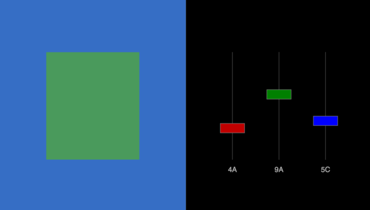

# rothko
See how one color looks on top of another

## What's this for?
Before I knew about the Inspector feature of Firefox and Chrome, I wanted a way to see how one color looks on top of another.
I was also interested in learning JavaScript, and this was a nice first project.
(I'm sure the code is terrible.)
I still sometimes find it useful for adjusting two colors until they're roughly the same lumosity.  By squinting (so your cones are out of the picture) and adjusting one of the channels, you'll find a sweet spot where you can't distinguish the foreground from the background.

## Why "Rothko"?
Mark Rothko was an abstract expressionist who made many large paintings with one color on top of another one.

## TODO
I don't plan to work on this anytime soon, but maybe some initiate will pick it up.
* A better implementation of the "hint" console, which presently cannot even be seen unless you scroll down
* Allow for adding new regions
* Link regions that should share the same color
* Allow addition of lorem ipsum
* Save a layout for later; scroll through saved layouts
